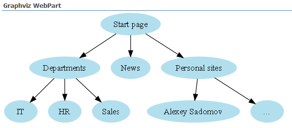
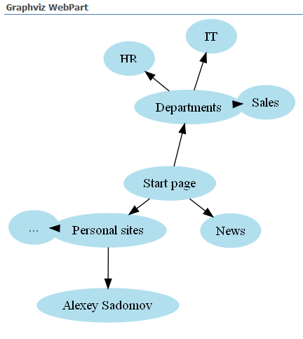

## Prerequisites
* [Graphviz](http://www.graphviz.org) should be installed on web server with Sharepoint. If you use multiple WFEs, Graphviz library should installed on all of them

## Installation
- Download and install [Graphviz](http://www.graphviz.org) library (choose Download > Windows > Stable and development Windows Install packages) on web server. During download ensure that you checked "Everyone" on first wizard step
- Download latest release of SPGraphviz. Currently release contains regular wsp package
- Install SPGraphvizWebPart.wsp on your server. Here are steps for single-WFE environment:
```
stsadm -o addsolution -filename SPGraphvizWebPart.wsp
stsadm -o deploysolution -local -allowgac -allcontenturls -name SPGraphvizWebPart.wsp
stsadm -o activatefeature -name SPGraphvizWebPart -url http://example.com
```
Where instead of http://example.com should be URL of your site collection. Now you should be able to add SPGraphvizWebPart on your publishing pages (it is located under Graphviz group)

## General
SPGraphvizWebPart uses [Graphviz](http://www.graphviz.org) open source library for rendering graphs defined on DOT language. Many objects in real life can be presented as a graph mathematical abstraction. E.g. organization structure, portal hierarchy, version history of the files, etc. - all these can be displayed as a graph (number of nodes with relations between them). Using DOT language you can create textual definition of a graph (nodes, relations, visual effects like color, shape, etc) in simple text file and pass this file into Graphviz library. It will make graphical representation of the graph using selected layout and image type.

Graphviz - is library written on C. SPGraphviz uses managed wrapper for using functions from Graphviz library. There are several implementations of managed wrapper for Graphviz:
* [WinGraphviz](http://wingraphviz.sourceforge.net/wingraphviz) by ood Tsen
* [Rendering an in-memory Graphviz image with C#](http://implicitoperator.com/blog/2009/12/24/rendering-an-in-memory-graphviz-image-with-c.html) by David Brown
WinGraphviz is implemented as COM component so it requires additional installation efforts from users. For SPGraphviz I used idea described by David Brown in his post (thanks to David for sharing it!), i.e. managed wrapper is implemented as standard p/invoke class with external functions declarations. The exact rendering is performed in native Graphviz library so it should be installed on web server prior to use SPGraphviz.

## SPGraphvizWebPart
SPGraphvizWebPart is a regular Sharepoint web part which allows you to visualize graphs. There are several custom properties (located under "Custom settings" category in web part properties editor):


* Dot file URL
* Image type
* Layout type
* Css class of image

Here are brief descriptions of each property
**Dot file URL**
Contains absolute URL of a file with graph definition on DOT language. It is simple .txt file uploaded to documents library on your site collection.

IMPORTANT NOTE: because of security reasons by default you can specify URL to the file which located only on the same host where web part is installed. E.g. if you installed SPGraphvizWebPart on http://example.com or http://example.com/SubSiteColl - then by default SPGraphvizWebPart allows you to visualize text files from example.com host. It was made intentionally because graph rendering is performed in native code and it requires system resources. So malicious users can specify URL of the big file which located on external site - and it will force rendering to occupy a lot of system resources causing DoS.

But there is possibility to manually specify external hosts which are considered as trusted locations. In order to do it you need to add additional parameter "GraphvizAllowedHosts" in <appSettings> section in web.config of your web application. Then add trusted hosts delimited by semicolumn:
```xml
<appSettings>
  ...
  <add key="GraphvizAllowedHosts" value="contoso.com;microsoft.com" />
</appSettings>
```
Remember that you should add hosts to "GraphvizAllowedHosts" only if you 100% trust this location.

**Image type**
Contains type which should be used for rendering. Currently allowed types are:
* png (default)
* bmp
* gif
* jpeg

**Layout type**
Contains type of layout:
* dot (default)
* neato
* fdp
* twopi
* circo

This is internal Graphviz types. You can play with them and see how the same graph is rendered using various layout types. E.g. here are examples of graphs displayed using dot and neato types:

dot layout:


neato layout:


**Css class of image**
Contains css class name which should be applied to rendered image
